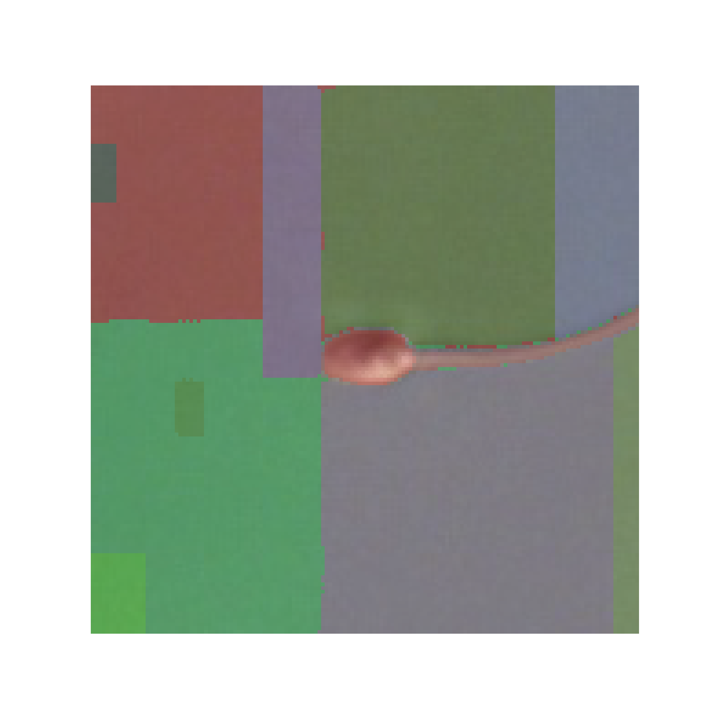
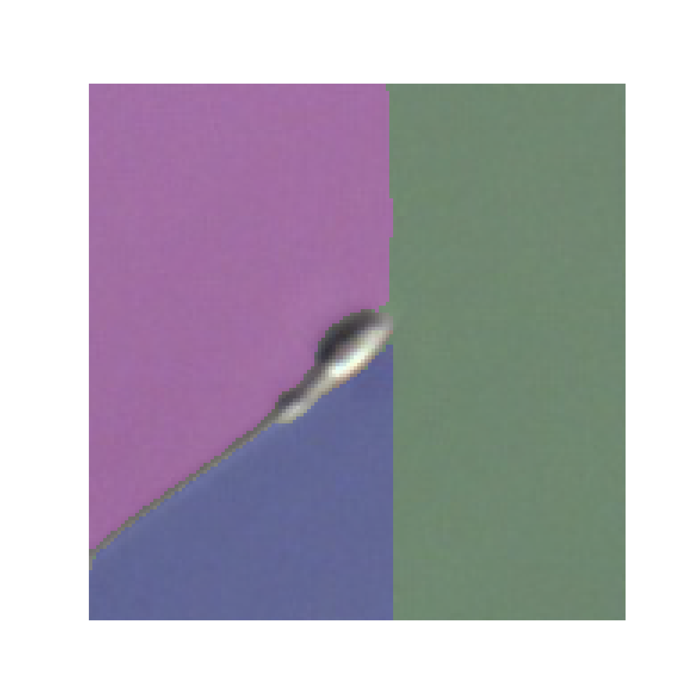
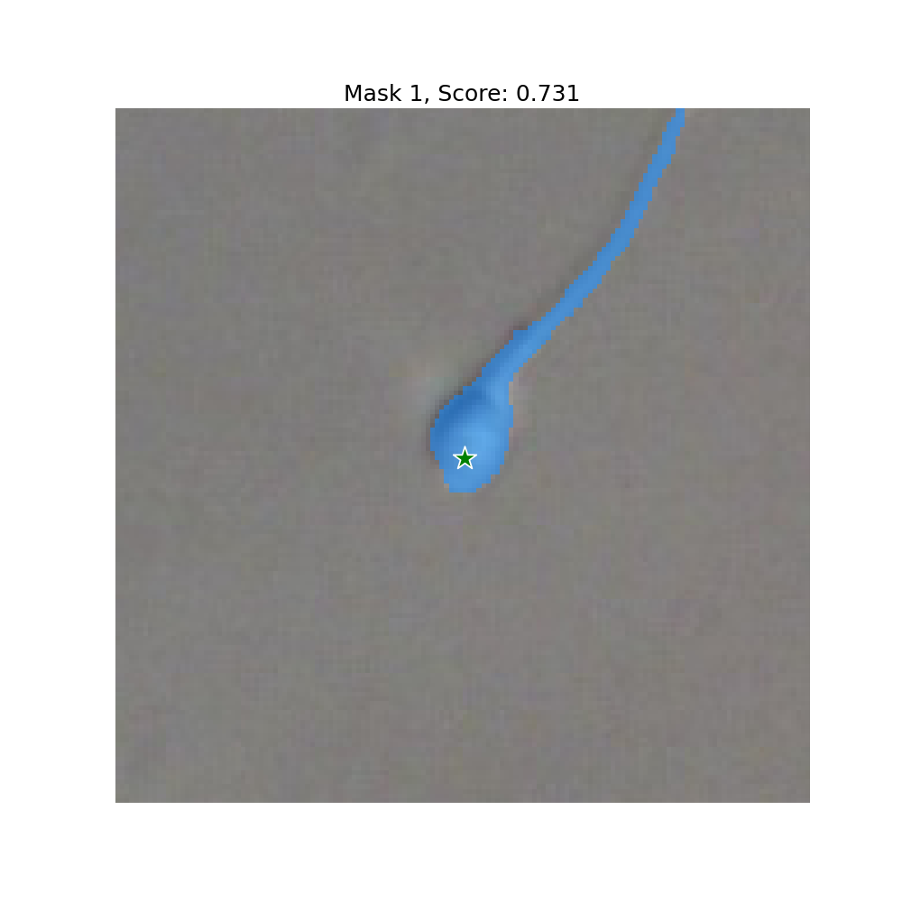

# 濱上研ゼミ: SAMを動かしてみよう
弊研究室で行っている深層学習の生殖医療応用にSAMを導入してみたいお気持ちで動かしてみるためのリポジトリ。
## 1. 環境
- Python 3.8.5
- torch 1.11.0+cu113

## 2. インストール
### Pytorch
```shell
pip install torch==1.11.0+cu113 torchvision==0.12.0+cu113 torchaudio==0.11.0 --extra-index-url https://download.pytorch.org/whl/cu113
```
### SAM
```shell
cd segment-anything
pip install -e .
```

## 3. テスト
サンプルスクリプト
```shell
python test_sam.py \
    --device cuda \
    --mode auto \
    --model_type vit_h \
    --checkpoint download_model/sam_vit_h_4b8939.pth \
    --data_type test_image \
    --sperm_path image/groceries.jpg 
```
シェルスクリプト
```shell
bash test_image.sh
```
or
```shell
bash test_sperm.sh
```

## 結果


