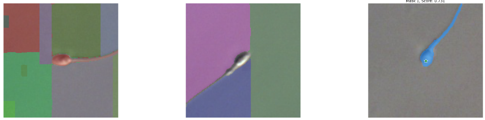

# SAMを動かしてみる
深層学習の生殖医療応用にSAMを導入してみたいお気持ちで動かしてみるためのリポジトリ。
## 1. 環境
- Python 3.8.5
- torch 1.11.0+cu113

## 2. インストール
### Pytorch
```shell
pip install torch==1.11.0+cu113 torchvision==0.12.0+cu113 torchaudio==0.11.0 --extra-index-url https://download.pytorch.org/whl/cu113
```
### SAM
```shell
cd segment-anything
pip install -e .
```

## 3. コードの簡単な説明
### モデルロード
```python
from segment_anything import sam_model_registry
model_type = 'vit_h'
checkpoint = 'path/to/checkpoint'
sam = sam_model_registry[model_type](checkpoint=checkpoint)
sam.to('cuda')
```
`model_type`に`vit_{b,l,h}`を指定し、`checkpoint`にパスを指定することで読み込める。
### プロンプト指定の場合
```python
from segment_anything import SamPredictor
predictor = SamPredictor(sam)
predictor.set_image(img)
masks, scores, logits = predictor.predict(
    point_coords=np.array([[75,75]])
    point_labels=np.array([1]),
    box=np.array([0,0,150,150]),
    multimask_output=True,
    return_logits=False,
)
```
プロンプトを指定する場合は、`SamPredictor()`を使用。
まず、`.set_image()`で入力画像を渡し、`.predict()`でセグメンテーションできる。

`point_coords` 点プロンプトの座標
`point_label` は点プロンプトのラベル
`box` ボックスプロンプトの座標
`multimask_output` Trueの場合、確信度の高い3つを出力
`return_logits` Trueの場合、logitを出力

### 自動(プロンプト指定しない)の場合
```python
from segment_anything import SamAutomaticMaskGenerator
predictor = SamAutomaticMaskGenerator(
    model=sam,
    points_per_side=32,
    points_per_batch=64,
    pred_iou_thresh=0.88,
    stability_score_thresh=0.95,
    stability_score_offset=1.0,
    box_nms_thresh=0.7,
    crop_n_layers=0,
    crop_nms_thresh=0.7,
    crop_overlap_ratio=512/1500,
    crop_n_points_downscale_factor=1,
    min_mask_region_area=0,
    output_mode='binary_mask',
)
masks = predictor.generate(img)
```
プロンプトを指定しない(自動の)場合は、`SamAutomaticMaskGenerator()`を使用。
`.generate()`に入力画像を渡すのみ。

`points_per_side`　


## 3. テスト
サンプルスクリプト
```shell
python test_sam.py \
    --device cuda \
    --mode auto \
    --model_type vit_h \
    --checkpoint download_model/sam_vit_h_4b8939.pth \
    --data_type test_image \
    --sperm_path image/groceries.jpg 
```
シェルスクリプト
```shell
bash test_image.sh
```
or
```shell
bash test_sperm.sh
```

## 結果
